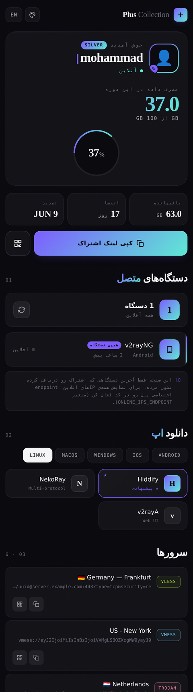

<div align="center">

# Plus Collection — PasarGuard Subscription Template

A modern, single-file subscription page template for [PasarGuard](https://github.com/PasarGuard/panel) panel.
Personalized themes, connected-device tracking, multi-language support — no build step required.

[](LICENSE)
[](https://github.com/PasarGuard/panel)
[](#)

[Installation](#installation) · [Customization](#customization) · [فارسی](#فارسی)


</div>

---

## Features

- **4 switchable themes** — Midnight, Gold, Emerald, Crimson — saved per-user in `localStorage`
- **24 selectable avatars** for personalization
- **Connected devices** — shows the client app, OS, online status, and last-seen time (parsed from the User-Agent). Optional live-IP endpoint for full device listing.
- **Smart alerts** — warns the user when their subscription is expiring or data is running low
- **Automatic tier badge** — Bronze / Silver / Gold / Platinum based on plan size
- **Bilingual** — Persian (RTL) and English (LTR) with instant switching
- **OS auto-detection** — recommends the right apps for the visitor's platform
- **One-tap import** for Hiddify, v2rayNG, Streisand, and more
- **QR codes** for every config, plus Base64 copy
- **Protocol badges** — VLESS, VMess, Trojan, Shadowsocks, Hysteria2, WireGuard, TUIC
- **Single HTML file** — no Node.js, no build, no dependencies to install

## Screenshots

| Midnight | Gold | Emerald |
|----------|------|---------|
|  |  |  |

## Installation

```bash
# 1. Copy the template onto your server
sudo mkdir -p /var/lib/pasarguard/templates/subscription
sudo cp index.html /var/lib/pasarguard/templates/subscription/index.html

# 2. Point PasarGuard at it
echo 'CUSTOM_TEMPLATES_DIRECTORY="/var/lib/pasarguard/templates/"' | sudo tee -a /opt/pasarguard/.env
echo 'SUBSCRIPTION_PAGE_TEMPLATE="subscription/index.html"'        | sudo tee -a /opt/pasarguard/.env

# 3. Restart
pasarguard restart
```

Open any user's subscription link in a browser and the new page appears.

## Customization

Everything is configured at the top of the `<script>` block in `index.html`.

### Support links

```js
const SUPPORT = [
  { name: { fa: "تلگرام", en: "Telegram" }, handle: "@YourChannel", url: "https://t.me/YourChannel", icon: "TG" },
  { name: { fa: "پشتیبانی", en: "Support" }, handle: "24/7 Live",   url: "https://t.me/YourSupport", icon: "24" },
  { name: { fa: "وب‌سایت", en: "Website" },  handle: "yoursite.com", url: "https://yoursite.com",     icon: "WB" },
];
```

### Default theme

Change the `data-theme` attribute on the very first line:

```html
<html lang="fa" dir="rtl" data-theme="midnight">  <!-- midnight | gold | emerald | crimson -->
```

### Live device/IP listing (optional, advanced)

By default the page shows the **last device** that fetched the subscription (from `sub_last_user_agent`).
To list **all** connected IPs, build a custom endpoint on your panel that returns JSON:

```json
[
  { "ip": "1.2.3.4", "user_agent": "v2rayNG/1.8.5", "last_seen": 1716300000 }
]
```

then set its URL in `index.html`:

```js
const ONLINE_IPS_ENDPOINT = 'https://panel.example.com/api/sub/online/{token}';
```

See [`docs/online-ips.md`](docs/online-ips.md) for a sample endpoint.

## Template variables

| Variable | Description |
|----------|-------------|
| `user.username` | Username |
| `user.status.value` | `active` / `limited` / `expired` / `disabled` / `on_hold` |
| `user.data_limit` | Total data in bytes (0 = unlimited) |
| `user.used_traffic` | Used data in bytes |
| `user.expire` | Expiry timestamp (0 = never) |
| `user.subscription_url` | Subscription URL |
| `user.links` | Array of config links |
| `user.sub_last_user_agent` | Last device User-Agent |
| `user.sub_updated_at` | Last subscription update time |
| `user.online_at` | Last online activity |

The template degrades gracefully when a variable is missing.

## Local preview

Open [`preview.html`](preview.html) in your browser — it is the same template filled with sample data.

## Contributing

Pull requests are welcome. For major changes, please open an issue first to discuss what you'd like to change.

## License

[MIT](LICENSE) — free to use, modify, and distribute.

## Credits

Built for the [PasarGuard](https://github.com/PasarGuard/panel) panel.

---

<div align="center" id="فارسی">

## فارسی

</div>

یک قالب صفحه اشتراک مدرن و تک‌فایل برای پنل **PasarGuard**.

### ویژگی‌ها
- **۴ تم رنگی** قابل انتخاب (Midnight، Gold، Emerald، Crimson)
- **۲۴ آواتار** قابل انتخاب
- **دستگاه‌های متصل** با تشخیص اپ و سیستم‌عامل از روی User-Agent
- **اعلان هوشمند** برای انقضای نزدیک یا اتمام حجم
- **سیستم Tier خودکار** (برنز/نقره/طلا/پلاتین)
- **دو زبانه** فارسی و انگلیسی با سوییچ لحظه‌ای
- **تک فایل HTML** بدون نیاز به build

### نصب

```bash
sudo mkdir -p /var/lib/pasarguard/templates/subscription
sudo cp index.html /var/lib/pasarguard/templates/subscription/index.html
echo 'CUSTOM_TEMPLATES_DIRECTORY="/var/lib/pasarguard/templates/"' | sudo tee -a /opt/pasarguard/.env
echo 'SUBSCRIPTION_PAGE_TEMPLATE="subscription/index.html"'        | sudo tee -a /opt/pasarguard/.env
pasarguard restart
```

### شخصی‌سازی
لینک‌های پشتیبانی، تم پیش‌فرض و سایر تنظیمات در ابتدای بخش `<script>` فایل `index.html` قابل تغییرند. برای جزئیات بیشتر بخش انگلیسی بالا را ببینید.

### مجوز
[MIT](LICENSE) — استفاده، تغییر و انتشار آزاد است.
